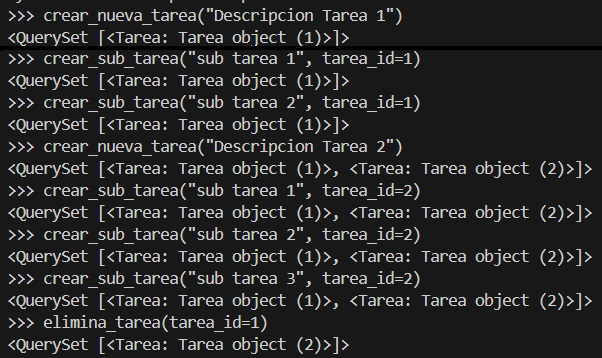
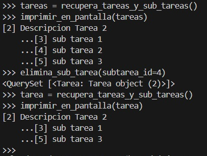
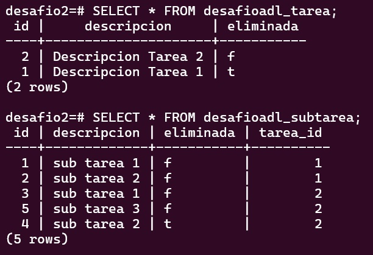

# Desafio Django - Acceso a Datos

Captura ingreso/eliminacion de datos con funciones de services.py

Captura impresion/eliminacion de datos con funciones de services.py

Captura Visualizacion de tablas en Postgres (con la columna "eliminada" en True(t/T) para aquellas entradas eliminadas en el shell de Python Django)

## Descripción

El proposito de este desafío es desarrollar un sistema de administración de tareas, donde las tareas principales pueden tener varias subtareas asociadas. Este desafío evalúa la comprensión de las características de Django aplicadas a las bases de datos, así como el conocimiento sobre las aplicaciones preinstaladas de Django y su utilidad para apoyar el desarrollo de proyectos robustos y escalables.

## Objetivos

- Implementar un Proyecto Django: Crear un proyecto denominado "desafio2" y dentro de él, una aplicación llamada "desafioadl".

- Modelado de Datos: Configurar dos modelos principales, Tarea y SubTarea. Tarea tendrá los campos id (identificador autonumérico), descripción y estado. SubTarea tendrá los mismos campos, adicionando una relación hacia Tarea.

- Configuración de Base de Datos: Permitir la conexión a través de SQLite o PostgreSQL.

- Servicios de Aplicación: Crear un archivo services.py en el directorio desafio2/desafioadl que contendrá funciones esenciales para manipular los modelos de datos, tales como crear, recuperar y eliminar tareas y subtareas.

- Funcionalidad Adicional: Desarrollar funciones en services.py que permitan imprimir en pantalla las tareas y subtareas de manera ordenada, facilitando la verificación y el seguimiento del estado de las tareas.

## Empezando 🚀

Para realizar este desafio, necesitas tener Python 3 instalado en tu sistema. Se recomienda usar un navegador web moderno como Google Chrome para acceder a la documentación en inglés y permitir la traducción automática del contenido.

### Pre-requisitos 📋

- Python 3.
- Conocimientos básicos de programación en Python.
- Conocimientos básicos de uso de la terminal o consola de comandos.
- Acceso a Internet para consultar la documentación oficial de Django y tutoriales complementarios.
- Librerias indicadas en el archivo "requeriments.txt"

## Autores ✒️

- **Emilio Madrid** - [EmilioMadridA](https://github.com/EmilioMadridA)

## Agradecimientos 🎁

- A todo el equipo de Desafio Latam y Talento Digital por la oportunidad de aprender y crecer en el campo del desarrollo web con Python y Django.
- A Brayan y Gustavo, por todo lo enseñado.